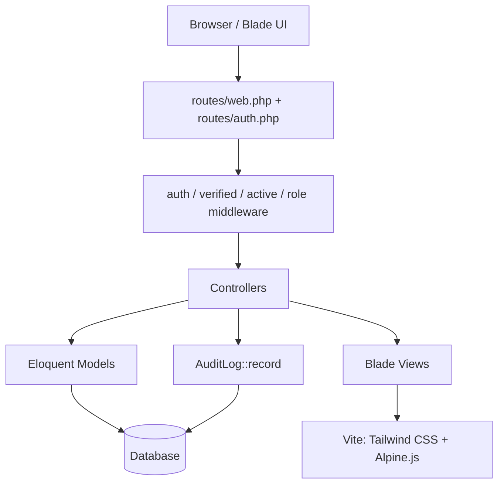
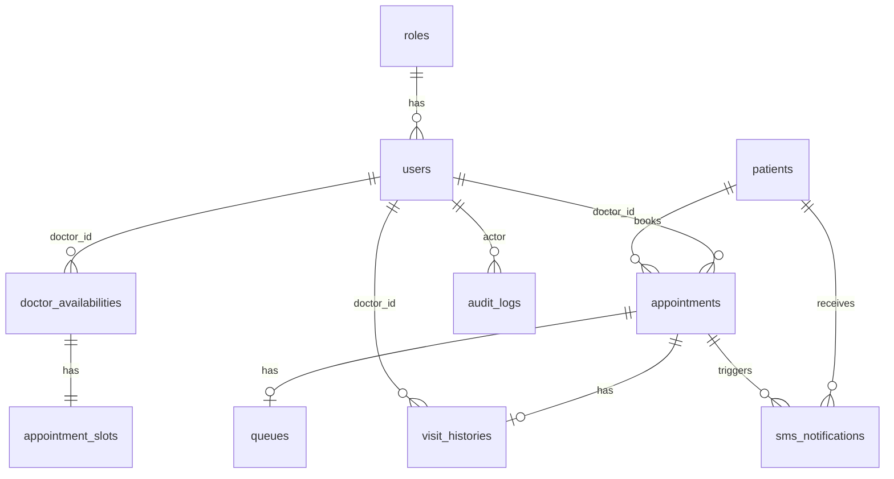

# RHUConnect System Structure

## 1. Project Overview

### Purpose

RHUConnect is a Laravel-based healthcare management system for the Rural Health Unit context. The implemented application currently covers staff authentication, account status enforcement, role-based administrator access, administrator staff account management, profile management, audit logging for selected auth/admin events, and database models/schema for patients, doctor availability, appointment slots, appointments, queues, visit histories, and SMS notifications.

### Tech Stack

- **Backend:** PHP `^8.2`, Laravel Framework `^12.0`
- **Frontend:** Blade templates, Tailwind CSS, Alpine.js
- **Database:** Laravel database layer with default SQLite configuration; config also includes MySQL, MariaDB, PostgreSQL, SQL Server, and Redis connection options
- **Authentication:** Laravel session guard (`web`) with Eloquent user provider; Laravel Breeze-style controllers/views
- **Build tooling:** Vite `^7.0.7`, Laravel Vite Plugin `^2.0.0`
- **Testing:** PHPUnit `^11.5.50`, Laravel feature/unit tests
- **Key UI libraries:** Tailwind CSS `^3.1.0`, `@tailwindcss/forms` `^0.5.2`, Alpine.js `^3.4.2`

### High-Level Architecture



## 2. Folder & File Structure

Relevant project tree, excluding `node_modules`, `vendor`, storage caches, and build artifacts:

```text
.
+-- app/
|   +-- Http/
|   |   +-- Controllers/
|   |   |   +-- Admin/UserManagementController.php
|   |   |   +-- Auth/*.php
|   |   |   +-- ProfileController.php
|   |   +-- Middleware/
|   |   |   +-- EnsureUserIsActive.php
|   |   |   +-- EnsureUserHasRole.php
|   |   +-- Requests/
|   |       +-- Auth/LoginRequest.php
|   |       +-- ProfileUpdateRequest.php
|   +-- Models/
|   |   +-- Appointment.php
|   |   +-- AppointmentSlot.php
|   |   +-- AuditLog.php
|   |   +-- DoctorAvailability.php
|   |   +-- Patient.php
|   |   +-- Queue.php
|   |   +-- Role.php
|   |   +-- SmsNotification.php
|   |   +-- User.php
|   |   +-- VisitHistory.php
|   +-- Providers/AppServiceProvider.php
|   +-- View/Components/
+-- bootstrap/
|   +-- app.php
|   +-- providers.php
+-- config/
|   +-- app.php
|   +-- auth.php
|   +-- cache.php
|   +-- database.php
|   +-- filesystems.php
|   +-- logging.php
|   +-- mail.php
|   +-- queue.php
|   +-- rhuconnect.php
|   +-- services.php
|   +-- session.php
+-- database/
|   +-- factories/
|   +-- migrations/
|   +-- seeders/
|   +-- database.sqlite
+-- public/
|   +-- index.php
|   +-- favicon.ico
|   +-- robots.txt
+-- resources/
|   +-- css/app.css
|   +-- js/app.js
|   +-- js/bootstrap.js
|   +-- views/
|       +-- admin/
|       +-- auth/
|       +-- components/
|       +-- layouts/
|       +-- profile/
|       +-- dashboard.blade.php
|       +-- welcome.blade.php
+-- routes/
|   +-- auth.php
|   +-- console.php
|   +-- web.php
+-- tests/
|   +-- Feature/
|   +-- Unit/
+-- artisan
+-- composer.json
+-- package.json
+-- phpunit.xml
+-- postcss.config.js
+-- tailwind.config.js
+-- vite.config.js
```

### Major Folder/File Responsibilities

- `app/Http/Controllers`: Request handlers for auth, profile, and admin user management screens.
- `app/Http/Middleware`: Custom authorization gates for active users and role checks.
- `app/Http/Requests`: Form request validation and login authentication/rate limiting.
- `app/Models`: Eloquent models and relationships for users, roles, audit logs, and healthcare domain tables.
- `bootstrap/app.php`: Laravel 12 application bootstrap; registers custom middleware aliases `active` and `role`.
- `config/rhuconnect.php`: RHUConnect-specific administrator seeding configuration.
- `database/migrations`: Database schema for Laravel core tables, RBAC, audit logs, and healthcare domain entities.
- `database/seeders`: Seeds roles and the initial administrator account.
- `resources/views/auth`: Login, password reset, email verification, confirmation, and register Blade views.
- `resources/views/admin`: Administrator dashboard and staff user management views.
- `resources/views/layouts`: Shared app and guest layouts plus navigation.
- `resources/js/app.js`: Starts Alpine.js after importing `bootstrap.js`.
- `resources/css/app.css`: Tailwind directives and `x-cloak` rule.
- `routes/web.php`: Main web routes for dashboards, admin users, and profile.
- `routes/auth.php`: Authentication, password, email verification, and logout routes.
- `tests/Feature`: Feature coverage for auth, profile, admin access, and admin user management.

## 3. Modules Breakdown

| Module / Feature | Status | Key Files | Description |
|---|---|---|---|
| Landing redirect | Done | `routes/web.php` | `/` redirects authenticated users to dashboard and guests to login. |
| Login / logout | Done | `routes/auth.php`, `AuthenticatedSessionController.php`, `LoginRequest.php`, `resources/views/auth/login.blade.php` | Session-based login with remember-me, throttle protection, active-account check, redirects by role, and logout session invalidation. |
| Password reset | Done | `PasswordResetLinkController.php`, `NewPasswordController.php`, `resources/views/auth/forgot-password.blade.php`, `resources/views/auth/reset-password.blade.php` | Laravel password reset token flow via `password_reset_tokens`. |
| Password confirmation/update | Done | `ConfirmablePasswordController.php`, `PasswordController.php`, profile password partial | Supports password confirmation and authenticated password updates. |
| Email verification | Done | `EmailVerificationPromptController.php`, `VerifyEmailController.php`, `EmailVerificationNotificationController.php`, `resources/views/auth/verify-email.blade.php` | Uses Laravel signed verification URL flow; dashboard routes require `verified`. |
| Public registration | Not started / disabled | `routes/auth.php`, `RegisteredUserController.php`, `resources/views/auth/register.blade.php`, `tests/Feature/Auth/RegistrationTest.php` | Controller/view exist from scaffold, but no registration routes are registered; tests expect public registration to be disabled. |
| Role management seed data | Done | `Role.php`, `RoleSeeder.php`, `AdminUserSeeder.php`, `config/rhuconnect.php` | Seeds Administrator, Doctor, Nurse, Midwife, and Data Encoder roles plus initial admin from env config. |
| Active account enforcement | Done | `EnsureUserIsActive.php`, `LoginRequest.php`, `User.php`, `routes/web.php` | Blocks inactive users at login and via protected route middleware. |
| Role-based authorization | Done | `EnsureUserHasRole.php`, `User.php`, `bootstrap/app.php`, `routes/web.php` | Restricts admin dashboard and user management routes to users with the `Administrator` role. |
| Basic user dashboard | Done / basic | `resources/views/dashboard.blade.php`, `routes/web.php` | Authenticated non-admin landing page showing a logged-in message. |
| Admin dashboard | Done / basic | `resources/views/admin/dashboard.blade.php`, `routes/web.php` | Administrator landing page with link to user management. |
| Admin user management | Done | `UserManagementController.php`, `resources/views/admin/users/*.blade.php`, `tests/Feature/AdminUserManagementTest.php` | Admin CRUD-like staff account management without delete; supports search/filter, create, show, edit, password change, activate/deactivate. |
| Profile management | Done | `ProfileController.php`, `ProfileUpdateRequest.php`, `resources/views/profile/**` | Authenticated users can edit profile, update password, and delete their own account. |
| Audit logging | In progress | `AuditLog.php`, `2026_08_14_000002_create_audit_logs_table.php`, auth/admin controllers | Records login failures/successes, blocked inactive login, logout, and admin user create/update/status events; no audit log UI exists. |
| Patient records | Not started UI / schema ready | `Patient.php`, `PatientFactory.php`, patient migration | Model, factory, and table exist; no routes/controllers/views found. |
| Doctor availability | Not started UI / schema ready | `DoctorAvailability.php`, `DoctorAvailabilityFactory.php`, migration | Model, factory, and table exist; no routes/controllers/views found. |
| Appointment slots | Not started UI / schema ready | `AppointmentSlot.php`, `AppointmentSlotFactory.php`, migration | Model, factory, and table exist; no routes/controllers/views found. |
| Appointments | Not started UI / schema ready | `Appointment.php`, `AppointmentFactory.php`, migration | Model, factory, and table exist; no routes/controllers/views found. |
| Queue management | Not started UI / schema ready | `Queue.php`, `QueueFactory.php`, migration | Model, factory, and table exist; no routes/controllers/views found. |
| Visit histories | Not started UI / schema ready | `VisitHistory.php`, `VisitHistoryFactory.php`, migration | Model, factory, and table exist; no routes/controllers/views found. |
| SMS notifications | Not started integration / schema ready | `SmsNotification.php`, `SmsNotificationFactory.php`, migration | Model, factory, and table exist; no SMS provider/service integration found. |
| Frontend build pipeline | Done | `vite.config.js`, `tailwind.config.js`, `resources/css/app.css`, `resources/js/app.js` | Vite compiles Tailwind and Alpine-enabled JavaScript. |
| Automated tests | In progress | `tests/Feature/**`, `tests/Unit/ExampleTest.php` | Feature tests cover auth, profile, admin access, and admin user management; healthcare domain modules do not have feature routes to test yet. |

## 4. Authentication & Authorization

### Login Flow

1. Guest visits `GET /login`.
2. `AuthenticatedSessionController@create` returns `resources/views/auth/login.blade.php`.
3. Login form posts to `POST /login` with CSRF token, email, password, and optional `remember`.
4. `LoginRequest` validates required email/password.
5. `LoginRequest::authenticate()` rate-limits by lowercased email plus IP, then calls `Auth::attempt()` on the default `web` guard.
6. Failed attempts are rate-limited and logged as `auth.login_failed` with a hashed email in audit metadata.
7. Successful credentials are rejected if `Auth::user()->isActive()` is false; the user is logged out, the event `auth.login_blocked_inactive` is recorded, and a validation error is returned.
8. On success, `AuthenticatedSessionController@store` regenerates the session, records `auth.login_success`, and redirects administrators to `admin.dashboard` and other roles to `dashboard`.
9. Logout posts to `POST /logout`, logs out the web guard, invalidates the session, regenerates the CSRF token, records `auth.logout`, and redirects to `/`.

### Session / Token Handling

- Default guard: `web`
- Guard driver: `session`
- User provider: Eloquent `App\Models\User`
- Session driver default: `database`
- Password reset tokens table: `password_reset_tokens`
- Email verification: Laravel signed URL route with `signed` and `throttle:6,1` middleware
- CSRF protection: Blade forms use `@csrf`; Laravel web middleware stack handles validation

### Middleware and Guards

- `auth`: Requires an authenticated web session.
- `verified`: Requires verified email for dashboard/admin dashboard/admin user routes.
- `active`: Custom alias for `EnsureUserIsActive`; logs out inactive users and redirects to login.
- `role`: Custom alias for `EnsureUserHasRole`; aborts with 403 unless user has one of the requested role names.
- `guest`: Prevents authenticated users from accessing login/password reset request pages.

### Roles and Permissions

Roles are stored in the `roles` table and related to `users.role_id`.

Seeded roles:

- `Administrator`
- `Doctor`
- `Nurse`
- `Midwife`
- `Data Encoder`

Implemented permissions:

- `Administrator` can access `/admin/dashboard` and `/admin/users/*`.
- `Administrator` can create/manage staff accounts for `Doctor`, `Nurse`, `Midwife`, and `Data Encoder`.
- Admin user management intentionally excludes creating another administrator via the managed roles list.
- A user cannot deactivate their own administrator account through the status update path.
- Non-administrator authenticated users can access the basic `/dashboard` and profile routes if active; dashboard also requires email verification.

## 5. Database Schema

### Core and Auth Tables

- `users`: `id`, `role_id`, `name`, `email`, `email_verified_at`, `password`, `account_status`, `remember_token`, timestamps, `deleted_at`
- `roles`: `id`, `name`, timestamps
- `password_reset_tokens`: `email`, `token`, `created_at`
- `sessions`: `id`, `user_id`, `ip_address`, `user_agent`, `payload`, `last_activity`
- `audit_logs`: `id`, `user_id`, `event`, `ip_address`, `user_agent`, `metadata`, timestamps

### Healthcare Domain Tables

- `patients`: `id`, `first_name`, `middle_name`, `last_name`, `birthdate`, `sex`, `civil_status`, `address`, `barangay`, `contact_number`, `email`, timestamps, `deleted_at`
- `doctor_availabilities`: `id`, `doctor_id`, `available_date`, `start_time`, `end_time`, `status`, timestamps, `deleted_at`
- `appointment_slots`: `id`, `doctor_availability_id`, `maximum_slots`, `booked_slots`, generated `remaining_slots`, timestamps, `deleted_at`
- `appointments`: `id`, `patient_id`, `doctor_id`, `appointment_date`, `appointment_time`, `purpose_of_visit`, `status`, `remarks`, timestamps, `deleted_at`
- `queues`: `id`, `appointment_id`, `queue_number`, `priority_type`, `queue_status`, timestamps, `deleted_at`
- `visit_histories`: `id`, `appointment_id`, `doctor_id`, `diagnosis`, `prescription`, `notes`, `consultation_date`, timestamps, `deleted_at`
- `sms_notifications`: `id`, `patient_id`, `appointment_id`, `message`, `recipient_number`, `delivery_status`, `sent_at`, timestamps, `deleted_at`

### Queue/Cache Infrastructure Tables

- `cache`: `key`, `value`, `expiration`
- `cache_locks`: `key`, `owner`, `expiration`
- `jobs`: `id`, `queue`, `payload`, `attempts`, `reserved_at`, `available_at`, `created_at`
- `job_batches`: batch metadata and counters
- `failed_jobs`: failed queue payloads and exceptions

### Relationship Diagram



### Eloquent Relationships

- `Role` has many `User`.
- `User` belongs to `Role`.
- `User` has many `DoctorAvailability`, `Appointment`, and `VisitHistory` records as doctor.
- `AuditLog` belongs to `User`.
- `Patient` has many `Appointment` and `SmsNotification`.
- `DoctorAvailability` belongs to doctor `User` and has one `AppointmentSlot`.
- `AppointmentSlot` belongs to `DoctorAvailability`.
- `Appointment` belongs to `Patient` and doctor `User`; has one `Queue`; has one `VisitHistory`; has many `SmsNotification`.
- `Queue` belongs to `Appointment`.
- `VisitHistory` belongs to `Appointment` and doctor `User`.
- `SmsNotification` belongs to `Patient` and `Appointment`.

## 6. API Endpoints

No API route file or JSON API controllers were found. The application currently exposes web routes only.

### Web Routes

| Method | URI | Name | Handler | Protected |
|---|---|---|---|---|
| GET/HEAD | `/` | - | Closure redirect | No |
| GET/HEAD | `/login` | `login` | `AuthenticatedSessionController@create` | Guest |
| POST | `/login` | - | `AuthenticatedSessionController@store` | Guest |
| GET/HEAD | `/forgot-password` | `password.request` | `PasswordResetLinkController@create` | Guest |
| POST | `/forgot-password` | `password.email` | `PasswordResetLinkController@store` | Guest |
| GET/HEAD | `/reset-password/{token}` | `password.reset` | `NewPasswordController@create` | Guest |
| POST | `/reset-password` | `password.store` | `NewPasswordController@store` | Guest |
| GET/HEAD | `/verify-email` | `verification.notice` | `EmailVerificationPromptController` | Auth |
| GET/HEAD | `/verify-email/{id}/{hash}` | `verification.verify` | `VerifyEmailController` | Auth, signed, throttle |
| POST | `/email/verification-notification` | `verification.send` | `EmailVerificationNotificationController@store` | Auth, throttle |
| GET/HEAD | `/confirm-password` | `password.confirm` | `ConfirmablePasswordController@show` | Auth |
| POST | `/confirm-password` | - | `ConfirmablePasswordController@store` | Auth |
| PUT | `/password` | `password.update` | `PasswordController@update` | Auth |
| POST | `/logout` | `logout` | `AuthenticatedSessionController@destroy` | Auth |
| GET/HEAD | `/dashboard` | `dashboard` | Closure view | Auth, verified, active |
| GET/HEAD | `/admin/dashboard` | `admin.dashboard` | Closure view | Auth, verified, active, role:Administrator |
| GET/HEAD | `/admin/users` | `admin.users.index` | `UserManagementController@index` | Auth, verified, active, role:Administrator |
| POST | `/admin/users` | `admin.users.store` | `UserManagementController@store` | Auth, verified, active, role:Administrator |
| GET/HEAD | `/admin/users/create` | `admin.users.create` | `UserManagementController@create` | Auth, verified, active, role:Administrator |
| GET/HEAD | `/admin/users/{user}` | `admin.users.show` | `UserManagementController@show` | Auth, verified, active, role:Administrator |
| GET/HEAD | `/admin/users/{user}/edit` | `admin.users.edit` | `UserManagementController@edit` | Auth, verified, active, role:Administrator |
| PUT/PATCH | `/admin/users/{user}` | `admin.users.update` | `UserManagementController@update` | Auth, verified, active, role:Administrator |
| PATCH | `/admin/users/{user}/status` | `admin.users.status` | `UserManagementController@updateStatus` | Auth, verified, active, role:Administrator |
| GET/HEAD | `/profile` | `profile.edit` | `ProfileController@edit` | Auth, active |
| PATCH | `/profile` | `profile.update` | `ProfileController@update` | Auth, active |
| DELETE | `/profile` | `profile.destroy` | `ProfileController@destroy` | Auth, active |

## 7. Environment & Configuration

### Environment Variables

Names present in `.env.example`:

- `APP_NAME`
- `APP_ENV`
- `APP_KEY`
- `APP_DEBUG`
- `APP_URL`
- `APP_LOCALE`
- `APP_FALLBACK_LOCALE`
- `APP_FAKER_LOCALE`
- `APP_MAINTENANCE_DRIVER`
- `APP_MAINTENANCE_STORE`
- `PHP_CLI_SERVER_WORKERS`
- `BCRYPT_ROUNDS`
- `LOG_CHANNEL`
- `LOG_STACK`
- `LOG_DEPRECATIONS_CHANNEL`
- `LOG_LEVEL`
- `DB_CONNECTION`
- `DB_HOST`
- `DB_PORT`
- `DB_DATABASE`
- `DB_USERNAME`
- `DB_PASSWORD`
- `SESSION_DRIVER`
- `SESSION_LIFETIME`
- `SESSION_ENCRYPT`
- `SESSION_PATH`
- `SESSION_DOMAIN`
- `BROADCAST_CONNECTION`
- `FILESYSTEM_DISK`
- `QUEUE_CONNECTION`
- `CACHE_STORE`
- `CACHE_PREFIX`
- `MEMCACHED_HOST`
- `REDIS_CLIENT`
- `REDIS_HOST`
- `REDIS_PASSWORD`
- `REDIS_PORT`
- `MAIL_MAILER`
- `MAIL_SCHEME`
- `MAIL_HOST`
- `MAIL_PORT`
- `MAIL_USERNAME`
- `MAIL_PASSWORD`
- `MAIL_FROM_ADDRESS`
- `MAIL_FROM_NAME`
- `AWS_ACCESS_KEY_ID`
- `AWS_SECRET_ACCESS_KEY`
- `AWS_DEFAULT_REGION`
- `AWS_BUCKET`
- `AWS_USE_PATH_STYLE_ENDPOINT`
- `VITE_APP_NAME`
- `RHU_ADMIN_NAME`
- `RHU_ADMIN_EMAIL`
- `RHU_ADMIN_PASSWORD`

Additional env names referenced by config files:

- `APP_PREVIOUS_KEYS`
- `AUTH_GUARD`
- `AUTH_PASSWORD_BROKER`
- `AUTH_MODEL`
- `AUTH_PASSWORD_RESET_TOKEN_TABLE`
- `AUTH_PASSWORD_TIMEOUT`
- `DB_URL`
- `DB_FOREIGN_KEYS`
- `DB_SOCKET`
- `DB_CHARSET`
- `DB_COLLATION`
- `MYSQL_ATTR_SSL_CA`
- `DB_SSLMODE`
- `REDIS_URL`
- `REDIS_USERNAME`
- `REDIS_DB`
- `REDIS_CACHE_DB`
- `REDIS_CLUSTER`
- `REDIS_PREFIX`
- `REDIS_PERSISTENT`
- `REDIS_MAX_RETRIES`
- `REDIS_BACKOFF_ALGORITHM`
- `REDIS_BACKOFF_BASE`
- `REDIS_BACKOFF_CAP`
- `SESSION_EXPIRE_ON_CLOSE`
- `SESSION_CONNECTION`
- `SESSION_TABLE`
- `SESSION_STORE`
- `SESSION_COOKIE`
- `SESSION_SECURE_COOKIE`
- `SESSION_HTTP_ONLY`
- `SESSION_SAME_SITE`
- `SESSION_PARTITIONED_COOKIE`
- `DB_QUEUE_CONNECTION`
- `DB_QUEUE_TABLE`
- `DB_QUEUE`
- `DB_QUEUE_RETRY_AFTER`
- `BEANSTALKD_QUEUE_HOST`
- `BEANSTALKD_QUEUE`
- `BEANSTALKD_QUEUE_RETRY_AFTER`
- `SQS_PREFIX`
- `SQS_QUEUE`
- `SQS_SUFFIX`
- `REDIS_QUEUE_CONNECTION`
- `REDIS_QUEUE`
- `REDIS_QUEUE_RETRY_AFTER`
- `QUEUE_FAILED_DRIVER`
- `DB_CACHE_CONNECTION`
- `DB_CACHE_TABLE`
- `DB_CACHE_LOCK_CONNECTION`
- `DB_CACHE_LOCK_TABLE`
- `MEMCACHED_PERSISTENT_ID`
- `MEMCACHED_USERNAME`
- `MEMCACHED_PASSWORD`
- `MEMCACHED_PORT`
- `REDIS_CACHE_CONNECTION`
- `REDIS_CACHE_LOCK_CONNECTION`
- `DYNAMODB_CACHE_TABLE`
- `DYNAMODB_ENDPOINT`
- `POSTMARK_API_KEY`
- `RESEND_API_KEY`
- `SLACK_BOT_USER_OAUTH_TOKEN`
- `SLACK_BOT_USER_DEFAULT_CHANNEL`
- `AWS_URL`
- `AWS_ENDPOINT`
- `LOG_DAILY_DAYS`
- `LOG_SLACK_WEBHOOK_URL`
- `LOG_SLACK_USERNAME`
- `LOG_SLACK_EMOJI`
- `LOG_PAPERTRAIL_HANDLER`
- `PAPERTRAIL_URL`
- `PAPERTRAIL_PORT`
- `LOG_STDERR_FORMATTER`
- `LOG_SYSLOG_FACILITY`
- `MAIL_URL`
- `MAIL_EHLO_DOMAIN`
- `MAIL_SENDMAIL_PATH`
- `MAIL_LOG_CHANNEL`

### Config Files

- `config/app.php`: Application name, environment, debug mode, URL, locale, encryption key, and maintenance mode.
- `config/auth.php`: Auth guard/provider defaults, password reset broker/table, and password confirmation timeout.
- `config/cache.php`: Cache store drivers and lock table settings.
- `config/database.php`: Database connections, migration table, and Redis connection settings.
- `config/filesystems.php`: Local/public/S3 disk configuration.
- `config/logging.php`: Log channels and external log driver options.
- `config/mail.php`: Mail transports and sender identity.
- `config/queue.php`: Queue connection definitions and failed job storage.
- `config/rhuconnect.php`: Initial administrator seed credentials from env variables.
- `config/services.php`: Third-party service keys/channels for Postmark, Resend, AWS SES, and Slack notifications.
- `config/session.php`: Session storage, cookie, lifetime, encryption, and same-site settings.
- `bootstrap/app.php`: Route registration and middleware alias registration.
- `vite.config.js`: Laravel Vite input files and refresh behavior.
- `tailwind.config.js`: Tailwind content paths, Figtree font extension, and forms plugin.
- `postcss.config.js`: PostCSS/Tailwind processing configuration.
- `phpunit.xml`: Test runner configuration.

## 8. Dependencies

### PHP / Composer

- `laravel/framework`: Core Laravel application framework, routing, Blade, Eloquent, auth, sessions, queues, mail, validation, and testing integration.
- `laravel/tinker`: Interactive Laravel REPL.
- `fakerphp/faker` (dev): Test data generation for factories.
- `laravel/breeze` (dev): Authentication scaffold source; app retains Breeze-style auth/profile structure.
- `laravel/pail` (dev): Tail logs during local development.
- `laravel/pint` (dev): PHP code style formatting.
- `laravel/sail` (dev): Docker-based Laravel development environment tooling.
- `mockery/mockery` (dev): Mocking library used by Laravel/PHPUnit tests.
- `nunomaduro/collision` (dev): Improved console exception output.
- `phpunit/phpunit` (dev): Test runner.

### Node / Frontend

- `vite`: Frontend build tool.
- `laravel-vite-plugin`: Connects Laravel Blade asset loading with Vite.
- `tailwindcss`: Utility-first CSS framework used across Blade views.
- `@tailwindcss/forms`: Form control styling plugin.
- `@tailwindcss/vite`: Tailwind/Vite integration package present in dependencies.
- `alpinejs`: Lightweight frontend interactivity for navigation dropdowns, modals, and login password visibility.
- `axios`: HTTP client imported by Laravel bootstrap scaffolding.
- `autoprefixer`: CSS vendor prefix processing.
- `postcss`: CSS transformation pipeline.
- `concurrently`: Runs Laravel server, queue listener, pail, and Vite dev server together via Composer `dev` script.

## 9. Known Gaps / TODOs

- No `routes/api.php` or API controllers were found; the system exposes web routes only.
- Public registration is intentionally disabled by route omission, even though scaffolded controller/view files still exist.
- Healthcare domain entities have models, factories, migrations, and relationships, but no implemented routes/controllers/views were found for:
  - Patients
  - Doctor availability
  - Appointment slots
  - Appointments
  - Queues
  - Visit histories
  - SMS notifications
- SMS notifications have schema/model support, but no SMS gateway configuration, service class, sending job, or delivery integration was found.
- Audit logging records selected auth and admin account events, but no audit log viewer/export/admin screen was found.
- The basic user dashboard only displays a logged-in confirmation message.
- Admin dashboard is a basic entry page linking to user management.
- `README.md` is still the default Laravel README and does not document RHUConnect-specific setup.
- `database/database.sqlite`, compiled view cache files, logs, and Vite hot/build artifacts are present locally; these are runtime/generated artifacts, not application modules.
- `resources/views/welcome.blade.php` appears to be the default Laravel welcome page and is not used by `/`, which redirects to login/dashboard.
- No WIP/TODO comments were found in application code beyond scaffold/default comments and disabled-state UI text.
